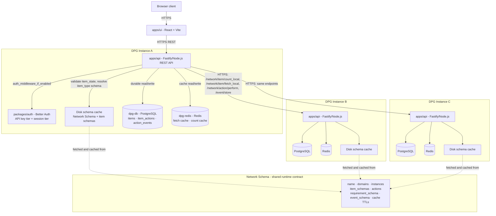
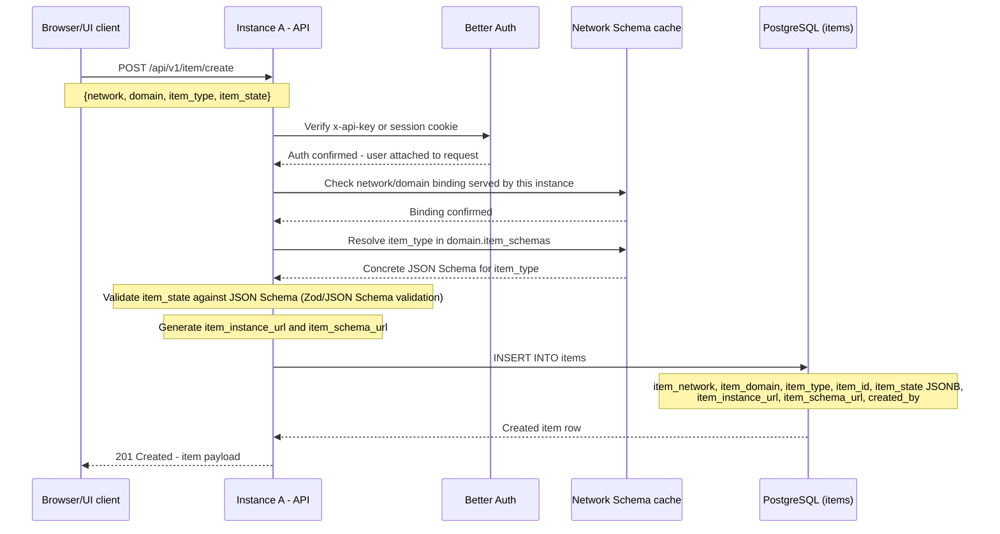
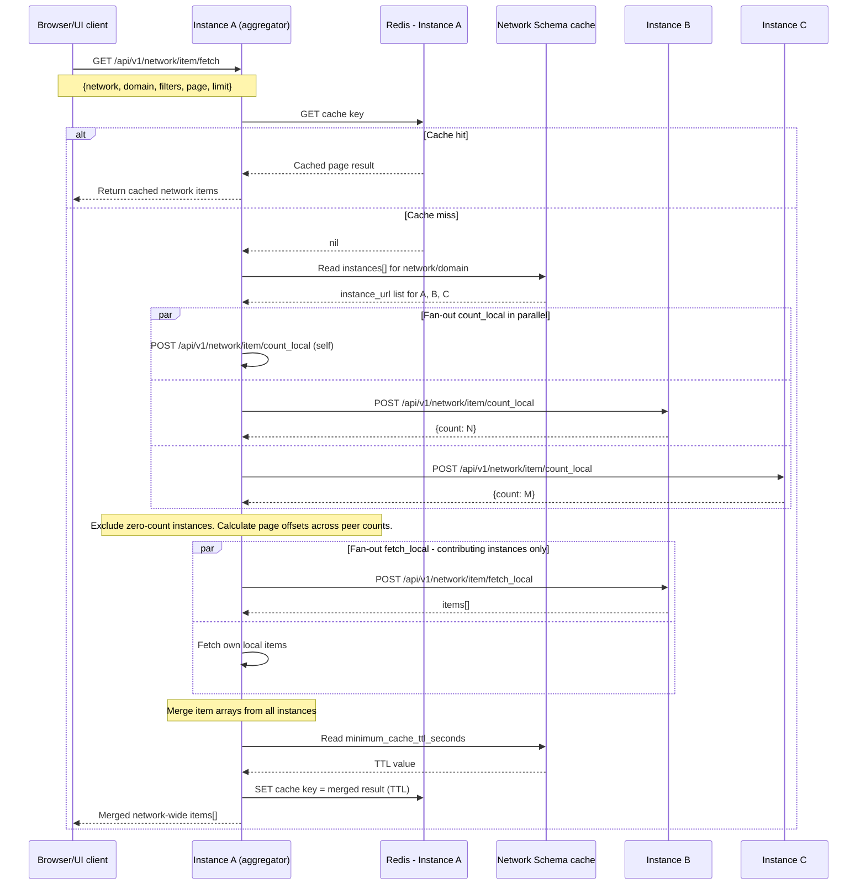
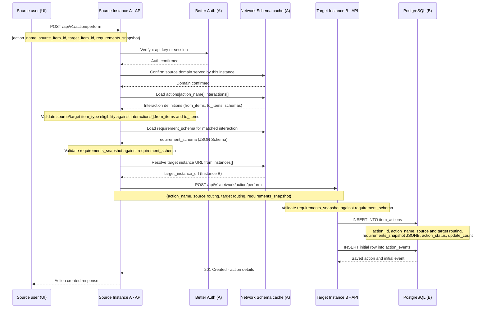
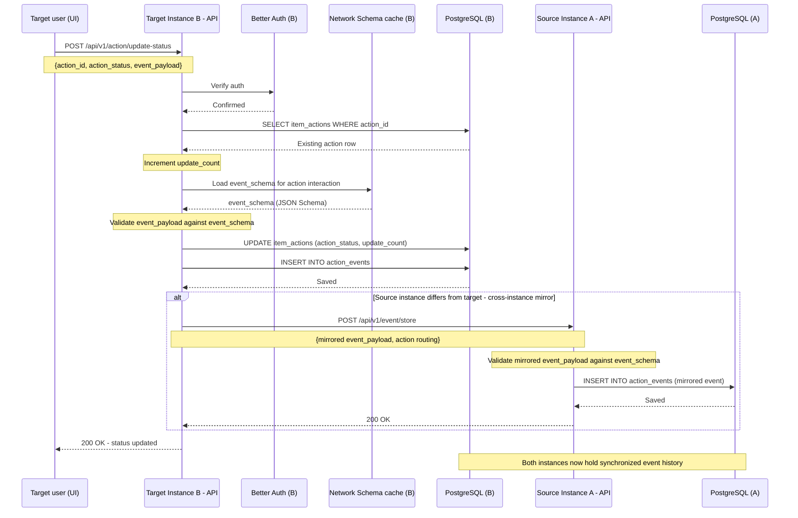
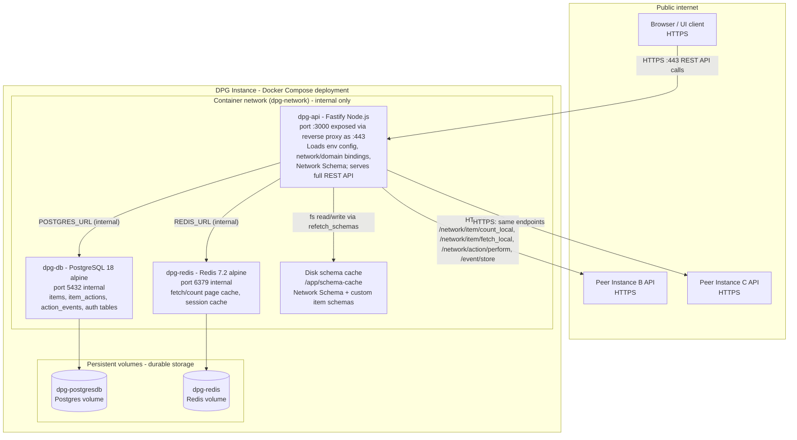

DPG is a decentralized, schema-driven Digital Public Good backend.

Stack: Fastify/Node.js, TypeScript ESM, PostgreSQL with Drizzle ORM, Redis, Better Auth, Docker, and Dokploy.

## 1. System Architecture

Each DPG instance owns its own PostgreSQL and Redis. The Network Schema is the shared runtime contract fetched and cached locally by each instance. Instances communicate only over HTTPS APIs, never through a shared database.

## 2. Item Creation Flow

Client submits `item_state` against a typed domain. Auth is verified, the Network Schema confirms the domain binding and resolves the item type's JSON Schema, `item_state` is validated, and the item is durably written to PostgreSQL.

## 3. Inter-instance Network Item Fetch Flow

Instance A acts as aggregator. It checks Redis first, discovers peers from Network Schema `instances[]`, fans count and fetch requests out in parallel, merges results, and caches the merged page honoring `minimum_cache_ttl_seconds`.

## 4. Cross-instance Action Perform Flow

Source instance validates eligibility and `requirements_snapshot` against the `requirement_schema` from the Network Schema, resolves the target instance URL via `instances[]`, then forwards the action over HTTPS. The target stores the action row and initial event.

## 5. Action Status Update and Event Mirroring Flow

Target-side user updates the action status. The event is validated against `event_schema`, stored, and mirrored back to the source instance at `/event/store`. Both instances end with a synchronized `action_events` history.

## 6. Deployment Architecture

Each DPG instance is an independent Docker Compose deployment. The three services share a private container network. Persistent volumes back both Postgres and Redis. External HTTPS reaches only the API container; peer-to-peer calls traverse the public network using HTTPS instance URLs.

## 7. Architectural Boundary Notes

### Schema contract boundary

The Network Schema is the single shared contract: item type validity, action rules, peer discovery, and cache TTLs. Each instance fetches and caches it locally on disk. It is not a central runtime service unless externally hosted.

### Instance isolation boundary

Every DPG instance owns its PostgreSQL and Redis exclusively. No cross-instance DB access occurs. Peers communicate only via four defined HTTP endpoints: `count_local`, `fetch_local`, `network/action/perform`, and `event/store`.

### Cache vs durable storage boundary

PostgreSQL stores durable facts: `items`, `item_actions`, and `action_events`. Redis holds short-lived fetch/count page cache. Disk holds fetched schema files. Redis TTLs respect `minimum_cache_ttl_seconds` from the Network Schema.

### API-to-API communication boundary

All inter-instance calls are HTTPS using `instance_url` values from `instances[]`. The aggregating instance fans out to peers but never queries their databases. Each peer responds only from its own local Postgres store.

### Auth boundary

Auth is evaluated via `auth_middleware_if_enabled`. Two tiers are supported: API key auth through the `x-api-key` header for machine-to-machine callers, and session auth through cookies for browser clients. API key auth has highest priority. Auth can be disabled per config. Inter-instance internal endpoints use separate trust conventions.

:::note[Assumption]
Diagram 4 shows the target instance re-validating `requirements_snapshot` against its own schema cache. The source also validates before forwarding. If the target defers to the source's pre-validation instead, that step on the target side should be removed.
:::
